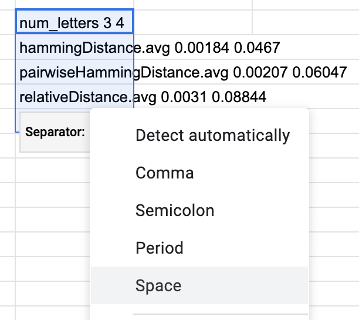

# README

This is `C` code that runs a program to solve the [Closest Strings](https://en.wikipedia.org/wiki/Closest_string)
problem. The purpose of writing this program is simply to have fun
optimizing this simple program as much as possible. 

## Closest Strings

For this code, we will use this following formal definition of the problem.

Given `N` length `M` strings `S={s_1, s_2, ..., s_N}` and given a distance 
function `distance` that takes two strings of length `M` as arguments and
returns an integer representing the distance of the two string arguments,
find the integer `k` and any new length-`M` string `s` such that 
`distance(s_i, s) <= k` where `k` is the smallest possible `k` for all 
`i` in range `[1..n]`. 

How can we prove that this is correct? Check that for every possible length-`M` 
string `s'`, `distance(s_i, s) <= distance(s_i, s')`. In other words, there 
doesn't exist any other string in the set of all possible strings of length `M`
that has a distance smaller than the one given by `s`.

The way this problem is formulated above should still be [W\[1\]-Hard](https://en.wikipedia.org/wiki/Parameterized_complexity#W_hierarchy) because to answer
the question of whether there exists an integer `k'` for which there exists a 
length-`M` string `s` such that the `distance(s_i, s) <= k'` could be answered
by solving for the smallest `k` and returning the boolean `k' >= k`.

## The Contract & Testing

One can optimize any parts of this projects as long as they pass all the tests
in this entire program. To run tests, simply do the following:

```bash
$ make tests
$ ./tests
```

It is highly encouraged to test any newly added code for correctness and 
faster iterations. For more details on how to write tests, simply take a look 
at `tests.h` which defines a lot of the testing methods. Then, `tests.c` runs
the tests. Tests can be written either in the `tests.c` or preferably in a 
file that defines them (such at `util_tests.h`). **When a test file is defined** 
**this way, it can only be included into `tests.c`** (or otherwise there will be
compile-time error).

## Running this Program

To run the program, first compile it via running `make cs` (or just `make`), and 
then one can run `./cs -l LENGTH -w WORD1 WORD2 WORD3 ...`. This, in terms of 
the formal definition above, will define `M` as the passed in `LENGTH` and the 
set `S` as `{WORD1, WORD2, WORD3, ...}`. To display the help, simply run `./cs -h`.

Here's an example of a run of the program:

```bash
$ make
clang -std=gnu11 -g -Wall -DNDEBUG -O3 -c cs.c -o cs.o
clang -std=gnu11 -g -Wall -DNDEBUG -O3 -c util.c -o util.o
clang -std=gnu11 -g -Wall -DNDEBUG -O3 -c closest_strings.c -o closest_strings.o
clang -std=gnu11 -g -Wall -DNDEBUG -O3 -c distances.c -o distances.o
clang  cs.o util.o closest_strings.o distances.o -o cs
$ ./cs -l 2 -w ax by cz da eb
== RUNNING CLOSEST STRING PROGRAM ==

M:         2
num_words: 5
words:     {ax, by, cz, da, eb}

> Benchmarking hammingDistance:
    time: 0.000115s
    results:
      k: 2
      m: 2
      s: aa
> Benchmarking relativeDistance:
    time: 0.000347s
    results:
      k: 13
      m: 2
      s: cm
> Benchmarking rotRelativeDistance:
    time: 0.000583s
    results:
      k: 4
      m: 2
      s: ba
> Benchmarking pairwiseHammingDistance:
    time: 0.000123s
    results:
      k: 6
      m: 2
      s: aa
```

Which simply outputs how long it takes to find the closest string `s` for 
each given distance function, the resulting `k` for that word, and its 
length `m` (which is always the same as the one given as argument to the 
program). Distance functions are simply functions from one string to another 
string of equal length. These functions return integers. We have four 
distance functions:
- **`hammingDistance`**  
  This is simply the number of character replacements it takes to convert 
  one string into another
- **`relativeDistance`**  
  Relative distance is also the number of replacements, except the cost of 
  replacements is the number of rotations it takes in the alphabet to go 
  from the first string to the second string. If we reach the end of the 
  alphabet, this simply wraps around.
- **`rotRelativeDistance`**  
  Same as relative distance except we can go backward, and we take the 
  shortest distance.
- **`pairwiseHammingDistance`**  
  This distance function is defined the following way. For each character 
  in the first word, look at each character in the second word, and if they 
  differ, the cost is increased by how far the characters are from each 
  other plus 1. More details in `distances.h`.

## Benchmarking Optimization Progress

To benchmark this script, simply run the `benchmark.py` script.

The final output of running the program with the arguments 
`./benchmark.py -m 1 -r 20 -v` may look like the following:

```
num_letters 3 4
hammingDistance.avg 0.00184 0.0467
pairwiseHammingDistance.avg 0.00207 0.06047
relativeDistance.avg 0.0031 0.08844
rotRelativeDistance.avg 0.00545 0.16162
```

By default, the number of words is `2`, and the style is `SIMPLE` (run 
`./benchmark --help` for more details). So, looking at the cell in the second 
row and second column, it means that that the average time to find the closest 
string with the `hammingDistance` distance function of the words `aaa` and `bbb` 
is `0.00184` seconds (average after running the program 20 times). Similarly, 
using the `relativeDistance` distance function with length 4 words `aaaa` and 
`bbbb` takes `0.08844` seconds on average for 20 runs.

**NOTE:** This script uses some non-backward compatible features of Python 3.8, 
so you will need to run it with [Python 3.8](https://www.python.org/downloads/release/python-380/).

### Pasting Into Google Sheets

The final output of this benchmarking script is meant to be easily pastable 
into Google Sheets. This is so that one can keep track of various times and 
actually be able to compare different optimizations that they've made over time.
To do so, simply do the following:

1. Copy the final output
  
2. Paste it into Google Sheets, click on the drop down, and select "Split text to columns"
  
3. Click on the "separator" dropdown, and choose "Space"
  
4. The final output should look like this:
  

### Easy Benchmarking

We have defined a few targets in the Makefile that can be used to run benchmarks.

- `make benchmark-simple`  
  Runs a benchmark with 3 words using the `SIMPLE` style.
- `make benchmark-vary`  
  Runs a benchmark with 3 words using the `VARY` style.
- `make benchmark-random`  
  Runs a benchmark with 3 words using the `RANDOM` style.

In addition, these scripts will run `make clean` and `make` to ensure they run
against the latest version. Finally, for all of these, one may also add `VERBOSE=1` 
to run the benchmark scripts with the `--verbose` flag. E.g., 
`make benchmark-vary VERBOSE=1`.
